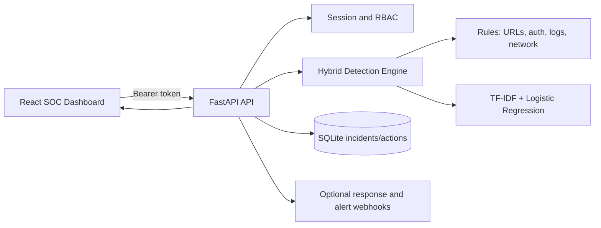

# CYBERGUARD Architecture

## Data Flow

## Detection Sources

- Email, SMS, social messages, URLs, and impersonation text use NLP-style keyword and URL heuristics plus the trained text classifier.
- Image, audio, and video uploads are accepted, hashed, persisted, and inspected from their bytes using image entropy, waveform, and video-container features. A specialized computer-vision or speech model can be added behind the same `/api/v1/analyze/file` contract.
- Authentication, system, network, API, malware, and exfiltration events use telemetry signature rules and produce risk indicators.

## Security Controls

- Login creates a signed JWT. Set `CYBERGUARD_JWT_SECRET` to a long secret outside development.
- Analyst users can inspect and create incidents.
- Lead users can execute response actions.
- SQLite stores incidents and action history.
- External actions remain disabled until webhook environment variables are configured.

## Main API Routes

- `POST /api/v1/auth/login`
- `POST /api/v1/analyze`
- `POST /api/v1/analyze/file`
- `GET /api/v1/incidents`
- `GET /api/v1/dashboard/metrics`
- `GET /api/v1/dashboard/timeline`
- `GET /api/v1/dashboard/graph`
- `GET /api/v1/system/health`
- `GET /api/v1/models/status`
- `GET /api/v1/compliance/controls`
- `GET /api/v1/compliance/mitre`
- `GET /api/v1/integrations/status`
- `POST /api/v1/integrations/siem/ingest`
- `PATCH /api/v1/incidents/{id}`
- `POST /api/v1/incidents/{id}/comments`
- `GET /api/v1/events/recent`
- `GET /api/v1/notifications`
- `PATCH /api/v1/notifications/{id}`
- `GET /api/v1/incidents/{id}`
- `POST /api/v1/threat-intel/lookup`
- `GET /api/v1/admin/users`
- `POST /api/v1/admin/users`
- `GET /api/v1/admin/audit`

## Operations and Deployment

- Dashboard polling refreshes persisted metrics and incident records every ten seconds.
- Incident operators can search, filter, assign, annotate, and move incidents through New, Investigating, Contained, Mitigated, and Closed states.
- MITRE ATT&CK mappings and compliance evidence are available through authenticated APIs.
- `Dockerfile` files and `docker-compose.yml` provide a repeatable deployment path.
- Set `CYBERGUARD_JWT_SECRET`, webhook URLs, and `CYBERGUARD_DB_PATH` through the deployment environment.
- `POST /api/v1/response/execute`
- `POST /api/v1/alert/dispatch`
