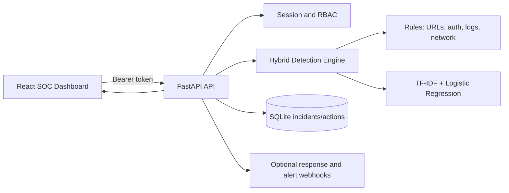

# CYBERGUARD Architecture

## Data Flow

## Detection Sources

- Email, SMS, social messages, URLs, and impersonation text use NLP-style keyword and URL heuristics plus the trained text classifier.
- Image, audio, and video uploads are accepted, hashed, persisted, and inspected from their bytes using image entropy, waveform, and video-container features. A specialized computer-vision or speech model can be added behind the same `/api/v1/analyze/file` contract.
- Authentication, system, network, API, malware, and exfiltration events use telemetry signature rules and produce risk indicators.

## Security Controls

- Login creates a signed JWT. Set `CYBERGUARD_JWT_SECRET` to a long secret outside development.
- Anonymous API evaluation is disabled by default. Set `CYBERGUARD_ALLOW_ANONYMOUS_EVAL=false` in every deployed environment.
- The application firewall records suspicious probes and can block repeat offenders; Cloudflare enforcement requires both `CLOUDFLARE_API_TOKEN` and `CLOUDFLARE_ZONE_ID`.
- Security email notifications require the `CYBERGUARD_SMTP_*` settings. Notifications are alerts, not an approval gate.
- Workspace access uses `POST /api/v1/access/request`, an owner approval link, and `GET /api/v1/access/status`; set `CYBERGUARD_PUBLIC_APP_URL` to the deployed frontend URL so approval links point to the correct environment.
- React code delivered to a browser cannot be made invisible to that browser's developer tools. Keep secrets, detection rules, and privileged operations on the backend.
- Analyst users can inspect and create incidents.
- Lead users can execute response actions.
- SQLite stores incidents and action history.
- External actions remain disabled until webhook environment variables are configured.

## Main API Routes

- `POST /api/v1/auth/login`
- `POST /api/v1/access/request`
- `GET /api/v1/access/status`
- `GET /api/v1/access/approve`
- `POST /api/v1/analyze`
- `POST /api/v1/analyze/file`
- `GET /api/v1/incidents`
- `GET /api/v1/dashboard/metrics`
- `GET /api/v1/dashboard/timeline`
- `GET /api/v1/dashboard/graph`
- `GET /api/v1/system/health`
- `GET /api/v1/models/status`
- `GET /api/v1/compliance/controls`
- `GET /api/v1/compliance/mitre`
- `GET /api/v1/integrations/status`
- `POST /api/v1/integrations/siem/ingest`
- `PATCH /api/v1/incidents/{id}`
- `POST /api/v1/incidents/{id}/comments`
- `GET /api/v1/events/recent`
- `GET /api/v1/notifications`
- `PATCH /api/v1/notifications/{id}`
- `GET /api/v1/incidents/{id}`
- `POST /api/v1/threat-intel/lookup`
- `GET /api/v1/admin/users`
- `POST /api/v1/admin/users`
- `GET /api/v1/admin/audit`

## Future Feature Roadmap (Serially Numbered)

This roadmap captures the advanced SOC feature ideas discussed for CyberGuard and maps them to the current architecture. Each item indicates the likely frontend surface, backend service, and integration point in the existing stack.

### 1. Adversarial self-testing
- Frontend: `ThreatInspector`, `ThreatIntelligence`, `CyberBrain`
- Backend: `detection_engine.py`, `main.py`
- Purpose: generate adversarial probes against the model and visualize confidence decay across blind spots.

### 2. Attacker-intent narrative generation
- Frontend: `CyberBrain`, `ThreatIntelligence`, `XaiModal`
- Backend: `main.py`, `campaign_engine.py`, `threat_fusion.py`
- Purpose: produce plain-language attacker goal hypotheses and next-move explanations.

### 3. Attacker fingerprint drift tracking
- Frontend: `ThreatDNA`, `ThreatGenome`, `ThreatFeed`
- Backend: `threat_fusion.py`, `campaign_engine.py`, `main.py`
- Purpose: track TTP drift and campaign evolution across incidents over time.

### 4. Defender fatigue-aware alert routing
- Frontend: `AdminConsole`, `NotificationsPanel`, `IncidentTable`
- Backend: `main.py`, `forecast_engine.py`, `response_simulator.py`
- Purpose: route alerts based on analyst load, burnout risk, and response capacity.

### 5. Simulated breach economics panel
- Frontend: `RiskGauge`, `ThreatCards`, `ThreatForecast`
- Backend: `forecast_engine.py`, `main.py`
- Purpose: convert technical severity into financial exposure and delay cost.

### 6. Adaptive honeytoken seeding
- Frontend: `ThreatInspector`, `SecurityFusionCenter`
- Backend: `main.py`, `detection_engine.py`
- Purpose: plant fake credentials and files in response to ongoing reconnaissance behavior.

### 7. Cross-modal deepfake consistency scoring
- Frontend: `AdvancedDefenseLab`, `ThreatInspector`
- Backend: `media_engine.py`, `main.py`
- Purpose: combine audio, image, video, and metadata consistency signals into one authenticity score.

### 8. Incident counterfactual replay
- Frontend: `CyberTimeMachine`, `ThreatIntelligence`, `DigitalTwin`
- Backend: `digital_twin.py`, `timeline_engine.py`, `main.py`
- Purpose: replay incident conditions with one variable changed to evaluate alternate outcomes.

### 9. Analyst bias detection
- Frontend: `AdminConsole`, `NotificationsPanel`, `IncidentTable`
- Backend: `main.py`, `audit/event logging`, `response_simulator.py`
- Purpose: detect alert-dismissal, escalation, and decision patterns by analyst over time.

### 10. Supply-chain blast radius mapping
- Frontend: `AttackGraph`, `ThreatMap`, `SystemView`
- Backend: `digital_twin.py`, `campaign_engine.py`, `main.py`
- Purpose: model vendor and third-party exposure propagation into the environment.

### 11. Living compliance diff
- Frontend: `ComplianceTab`, `AdminConsole`
- Backend: `main.py`, `compliance controls services`
- Purpose: auto-diff applied controls and detected gaps against new regulations and CVEs.

### 12. Threat immune memory
- Frontend: `ThreatFeed`, `ThreatInspector`, `IncidentTable`
- Backend: `main.py`, `threat_fusion.py`, `timeline_engine.py`
- Purpose: compress resolved incidents into memory rules and show what was caught by memory vs. fresh analysis.

### 13. Alert-to-outcome feedback scoring
- Frontend: `ThreatCards`, `MetricCards`, `AdminConsole`
- Backend: `main.py`, `detection_engine.py`, `dashboard metrics`
- Purpose: track whether a detection was right, wrong, or noisy and feed outcome quality back into the model accuracy dashboard.

### 14. Multi-tenant shared immunity layer
- Frontend: `AdminConsole`, `SecurityFusionCenter`
- Backend: `main.py`, `campaign_engine.py`, `threat_fusion.py`
- Purpose: anonymized resolved signatures from one tenant can improve detection for all tenants without leaking sensitive data.

### 15. Attacker resource-cost estimation
- Frontend: `ThreatInspector`, `ThreatIntelligence`, `CyberBrain`
- Backend: `detection_engine.py`, `campaign_engine.py`, `threat_fusion.py`
- Purpose: judge whether the attack appears low-sophistication commodity tooling or a custom, costlier campaign.

### 16. Session-level attention heatmap for analysts
- Frontend: `Header`, `Sidebar`, `ThreatInspector`, `IncidentTable`
- Backend: `main.py`, `audit logging`, `analytics events`
- Purpose: analyze where analysts click, spend time, and route decisions to optimize UI design around real SOC behavior.

### 17. Regulatory jurisdiction auto-routing
- Frontend: `ComplianceTab`, `AdminConsole`, `ThreatIntelligence`
- Backend: `main.py`, `compliance controls`, `incident metadata processing`
- Purpose: infer applicable breach-notification rules such as GDPR or DPDP based on data residency and cross-border signals.

### 18. Incident explainability score
- Frontend: `XaiModal`, `ThreatInspector`, `CyberBrain`
- Backend: `main.py`, `detection_engine.py`, `threat_fusion.py`
- Purpose: show how traceable and trustworthy the explanation is, and whether analysts should rely on it or verify manually.

## Frontend Development Priorities

- Core SOC workbench: `App`, `Sidebar`, `Header`, `MetricCards`, `IncidentTable`, `ThreatFeed`
- Threat intelligence panels: `ThreatIntelligence`, `ThreatDNA`, `ThreatGenome`, `CampaignCorrelation`
- Detection workflow: `ThreatInspector`, `TrustScanner`, `IocReputationFeed`
- Simulation layer: `FrontierCapabilities`, `AdvancedDefenseLab`, `SpeculativeDefenseWidget`, `ResponseSimulatorPanel`
- Governance and operations: `ComplianceTab`, `AdminConsole`, `NotificationsPanel`

## Backend Development Priorities

- Detection core: `detection_engine.py`, `extended_intel.py`, `threat_intel.py`
- Context and correlation: `campaign_engine.py`, `threat_fusion.py`, `digital_twin.py`, `timeline_engine.py`
- Forecasting and response: `forecast_engine.py`, `response_simulator.py`, `self_healing.py`, `battle_simulator.py`
- AI safety and simulation: `frontier_engine.py`, `advanced_defense_engine.py`, `speculative_defense_engine.py`
- API orchestration: `main.py`

## Operations and Deployment

- Dashboard polling refreshes persisted metrics and incident records every ten seconds.
- Incident operators can search, filter, assign, annotate, and move incidents through New, Investigating, Contained, Mitigated, and Closed states.
- MITRE ATT&CK mappings and compliance evidence are available through authenticated APIs.
- `Dockerfile` files and `docker-compose.yml` provide a repeatable deployment path.
- Set `CYBERGUARD_JWT_SECRET`, webhook URLs, and `CYBERGUARD_DB_PATH` through the deployment environment.
- `POST /api/v1/response/execute`
- `POST /api/v1/alert/dispatch`
